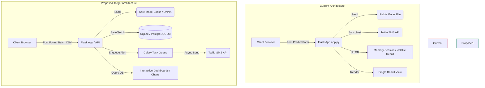

# Project Analysis & Improvement Plan

This document provides a comprehensive analysis of the **Intelligent Patient Health Risk Predictor** project. It outlines architectural flaws, security issues, machine learning inconsistencies, and UX limitations, proposing concrete solutions for each.

---

## Architecture Diagram

The diagram below contrasts the **Current Architecture** (with synchronous bottlenecks and lack of persistence) with the **Proposed Architecture** (introducing a database, asynchronous message queue, and retrained ML pipeline).



---

## 1. Machine Learning & Feature Inconsistency

> [!CAUTION]
> **Critical Issue: Highly Biased Model Predictions**
> In the current application, the Random Forest model is trained on **30 features** from the Breast Cancer Wisconsin dataset. However, the user interface (`templates/index.html`) only collects **10 features** (the "mean" metrics). The remaining 20 features (errors and worst-case values) are hardcoded as `0` in hidden HTML inputs (lines 195–214). 
> 
> Because Random Forest relies on splits across all 30 features, feeding constant `0` values for 20 features severely biases predictions and invalidates the model's reported accuracy (~94%).

### Suggested Improvements:
1. **Retrain on 10 Features:** Modify [train_model.py](file:///Users/sahilkumarsinha/Desktop/Intelligent%20Patient%20Health%20Risk%20Predictor/train_model.py) to train and serialize a model using *only* the 10 clinical features available on the dashboard.
   ```python
   # Slice the dataset to only include the first 10 columns (mean features)
   X = data.data[:, :10]
   feature_names = list(data.feature_names[:10])
   ```
2. **Model Serialisation Security:** Replace `pickle` with `joblib` or serialize to `ONNX` format. `pickle` is vulnerable to code injection and arbitrary execution when deserializing untrusted files.
3. **Data Scaling Pipeline:** Introduce a scikit-learn `Pipeline` in training that includes a standard scaler (`StandardScaler`) to make the model robust to outlier measurements.

---

## 2. Data Persistence & State Management

> [!WARNING]
> **Data Loss on Navigation/Refresh**
> The application uses an in-memory results listing. Every prediction is rendered immediately as a single element list `predictions=[result]` and is lost on page reload. The `/results` route displays an empty table because it passes an empty list (`predictions=[]`) due to the absence of a database.

### Suggested Improvements:
1. **Introduce a Relational Database:** Integrate **Flask-SQLAlchemy** with a local SQLite database for development, and support PostgreSQL/MySQL for production.
2. **Database Models:** Create structured tables for users and patient assessments:
   ```python
   # Example SQLAlchemy models
   class Patient(db.Model):
       id = db.Column(db.Integer, primary_key=True)
       name = db.Column(db.String(100), nullable=False)
       created_at = db.Column(db.DateTime, default=datetime.utcnow)

   class Assessment(db.Model):
       id = db.Column(db.Integer, primary_key=True)
       patient_id = db.Column(db.Integer, db.ForeignKey('patient.id'), nullable=False)
       timestamp = db.Column(db.DateTime, default=datetime.utcnow)
       # Store inputs as JSON or individual columns
       features = db.Column(db.JSON, nullable=False)
       risk_score = db.Column(db.Float, nullable=False)
       risk_label = db.Column(db.String(20), nullable=False)
       sms_status = db.Column(db.String(100))
   ```
3. **User Authentication:** Move away from hardcoded credentials `USERS = {"admin": "admin123"}`. Store hashed passwords using Flask-Login and Werkzeug's security hashing helpers.

---

## 3. Asynchronous Task Execution (SMS Alerting)

> [!IMPORTANT]
> **Synchronous API Bottleneck**
> When a prediction results in "High Risk", the app synchronously calls the Twilio API to send an SMS. If the Twilio API is slow or offline, the user interface hangs, leading to a poor user experience and possible HTTP request timeouts.

### Suggested Improvements:
1. **Asynchronous Background Tasks:** Use **Celery** (with Redis/RabbitMQ) or **Flask-Executor** (for a lightweight, thread-based solution) to offload the Twilio SMS call to a background worker.
   ```python
   # Example using Flask-Executor
   from flask_executor import Executor
   executor = Executor(app)

   # Inside the /predict route:
   if is_high_risk:
       executor.submit(send_high_risk_sms, patient_name, risk_proba)
   ```
2. **Robust Error Handling & Logging:** Save SMS delivery statuses, errors, and Twilio message SIDs to the database. Add retry logic for transient API failures.

---

## 4. UI / UX & Frontend Polish

While the page uses clean styling with custom animations, several elements can be improved to offer a professional clinical feel:

| Current State | Proposed Improvement |
| :--- | :--- |
| **No persistence** on `/results` page. | Populate the table from the SQLite database with filtering (by date, risk level, or patient name). |
| **Static Form Inputs:** Fields require typing raw numbers with no context. | Add tooltips explaining the clinical range and units (e.g., mm for radius, texture in standard deviation). |
| **No Data Visualization:** Predictions are shown strictly in tabular format. | Integrate **Chart.js** on the dashboard to visualize patient risk distributions or feature importance charts. |
| **Placeholder Code:** Duplicated files (`*.jinja index.html`) and hardcoded buttons. | Remove duplicate files, replace inline JavaScript handlers like `onclick="alert(...)"` with modal alerts. |

---

## 5. Development Operations & Codebase Integrity

1. **Clean Duplicate Files:** The templates folder contains duplicate files:
   - `base.jinja base.html` (identical to `base.html`)
   - `index.jinja index.html` (identical to `index.html`)
   These should be deleted to prevent developer confusion.
2. **Add Automated Testing:** Create a `tests/` directory with `pytest` scripts verifying:
   - Route accessibility and login guards.
   - Model input validation (handling non-numeric values, negative values, and empty values).
   - Prediction correctness against known feature samples.
3. **Configuration & Secrets Validation:** Add validation on application startup to raise descriptive errors if critical variables like `TWILIO_ACCOUNT_SID` or `FLASK_SECRET_KEY` are not set in the `.env` file.
4. **Interactive Setup Script:** Provide a setup shell script or Python script to automatically run migrations, train the baseline ML model, and verify Twilio connection settings.

---

## Summary Checklist for Next Iteration

- [ ] Retrain Random Forest model on **only** the 10 features entered in the form.
- [ ] Implement Flask-SQLAlchemy with SQLite database backend.
- [ ] Hash user passwords instead of hardcoding raw strings.
- [ ] Move SMS alerts to a background thread to prevent dashboard lockups.
- [ ] Delete duplicate template files (`*.jinja *`).
- [ ] Set up a suite of unit tests with `pytest`.
