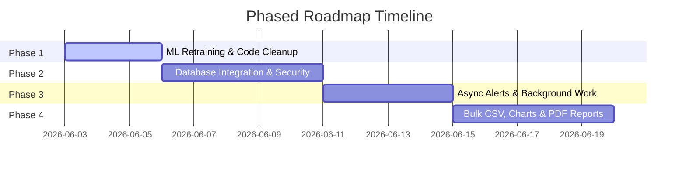

# Phased Project Improvement Roadmap

This roadmap breaks down the improvement tasks suggested in [improvement.md](file:///Users/sahilkumarsinha/Desktop/Intelligent%20Patient%20Health%20Risk%20Predictor/improvement.md) into structured, sequential development phases. Each phase represents a cohesive set of updates aimed at taking the project from a prototype to a production-ready clinical application.

---

---

## Phase 1: ML Correctness, Security & Cleanup (Current Focus)
**Goal:** Align the machine learning pipeline with UI input capabilities, remove redundant codebase files, and enforce configuration checks.

* **Tasks:**
  - [ ] **Fix Feature Imbalance in Model:**
    - Update [train_model.py](file:///Users/sahilkumarsinha/Desktop/Intelligent%20Patient%20Health%20Risk%20Predictor/train_model.py) to train only on the 10 features corresponding to the "mean" measurements of the Wisconsin Breast Cancer dataset (slice features using `X = data.data[:, :10]`).
    - Remove the 20 hidden input fields (errors and worst measurements) from [index.html](file:///Users/sahilkumarsinha/Desktop/Intelligent%20Patient%20Health%20Risk%20Predictor/templates/index.html).
  - [ ] **Safe Model Serialization:**
    - Migrate from `pickle` to `joblib` for model dumping and loading to prevent unsafe execution hazards.
  - [ ] **Clean Duplicate Template Assets:**
    - Delete `templates/base.jinja base.html` and `templates/index.jinja index.html` to keep the folder clean.
  - [ ] **Startup Environment Check:**
    - Validate presence of key variables (`TWILIO_ACCOUNT_SID`, `TWILIO_AUTH_TOKEN`, `FLASK_SECRET_KEY`, `DOCTOR_PHONE_NUMBER`) during application boot in [app.py](file:///Users/sahilkumarsinha/Desktop/Intelligent%20Patient%20Health%20Risk%20Predictor/app.py). Raise clear exceptions if missing.

---

## Phase 2: Database Integration & Secure Authentication
**Goal:** Establish a relational database for data persistence and implement industry-standard secure authentication.

* **Tasks:**
  - [ ] **Database Design & ORM setup:**
    - Install `flask-sqlalchemy` and configure a local SQLite database file.
    - Create schemas for:
      - `User` (Username, Hashed Password, Role, Active status).
      - `Patient` (Name, Created Date, Optional demographic details).
      - `Assessment` (Patient Foreign Key, Timestamp, 10 feature values stored as JSON, prediction risk score, risk label, Twilio SMS status).
  - [ ] **Password Security & Session Guards:**
    - Replace the hardcoded `USERS` dictionary with database-backed checks.
    - Use `werkzeug.security` (`generate_password_hash` and `check_password_hash`) to ensure no plain text passwords exist.
    - Setup `Flask-Login` for session handling, redirecting unauthorized users to `/login`.
  - [ ] **Populate History views:**
    - Update `/predict` to save every run to the database.
    - Refactor [results.html](file:///Users/sahilkumarsinha/Desktop/Intelligent%20Patient%20Health%20Risk%20Predictor/templates/results.html) and `/results` route to display historical patient entries fetched from the database, sorting by date and offering filter controls (e.g. Filter by Risk level).

---

## Phase 3: Asynchronous Operations & Alert Enhancements
**Goal:** Prevent UI freeze/sluggishness on high-risk cases by running external Twilio calls in a background thread or executor, and improve alerting logic.

* **Tasks:**
  - [ ] **Background Task Offloading:**
    - Integrate `flask-executor` (lightweight thread-pool) to execute `send_high_risk_sms` asynchronously.
    - The `/predict` controller should return the HTTP response immediately to the user while Twilio tasks execute in the background.
  - [ ] **Async DB Update:**
    - Pass the database `Assessment` ID to the background task so that the task can update the record with the Twilio message SID (on success) or the exception text (on failure).
  - [ ] **Fail-Safe Alert System:**
    - On the `/results` page, add a "Retry SMS Alert" button for any high-risk entry where the SMS status is marked as `Failed`.
  - [ ] **User Control Confirmation:**
    - Add a toggle switch in the UI dashboard to temporarily disable SMS alerts (e.g., during testing) without needing to modify `.env`.

---

## Phase 4: UI/UX Enrichments, Analytics & Bulk Upload
**Goal:** Add modern data dashboards, support bulk uploads of patient history, and generate exportable clinical summaries.

* **Tasks:**
  - [ ] **Bulk CSV Prediction Support:**
    - Expand the `/upload` route to support standard CSV parsing.
    - Accept a CSV file, validate that its columns match the 10 required features, run batch predictions, save results to the database, and display a summary report screen.
  - [ ] **Visual Analytics Dashboard:**
    - Add **Chart.js** to show high-level metrics on the dashboard:
      - Line chart showing risk scores over time for selected patients.
      - Donut chart displaying the ratio of Low Risk vs High Risk cases.
  - [ ] **Exportable Patient Summaries:**
    - Enable downloading an assessment sheet for a patient as a formatted PDF report containing their clinical readings, risk evaluation, and recommendations.
  - [ ] **Input Guidelines:**
    - Add tooltips and helper labels in [index.html](file:///Users/sahilkumarsinha/Desktop/Intelligent%20Patient%20Health%20Risk%20Predictor/templates/index.html) explaining normal ranges for clinical values (e.g. Mean Radius, Texture) to guide clinicians on standard deviation metrics.
